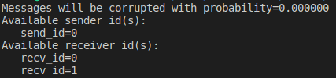
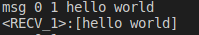
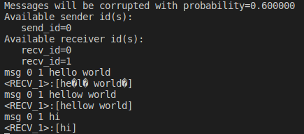

# Sliding Window Protocol  
Selective Retransmission and Cumulative ACK

### **Implementing Sliding Window Protocol that uses selective retransmission and cumulative ACK.**
# **Overview**
For this project, you will be tasked with implementing communication between two or more hosts. To make the project easier to test on your local machine, we will be implementing the hosts as threads that run on your processor, and we will be simulating the network links between these hosts (threads). There are two types of hosts (threads) you are responsible for implementing: **senders** and **receivers**.

Sender hosts must transmit messages typed in at the command line to a corresponding receiver host. The network links between hosts can only support a maximum frame size of MAX\_FRAME\_SIZE bytes. Thus, depending on the message size, it may need to be split into multiple data frames before being sent to the receiver. The receiver needs to reassemble all data frames belonging to a message to retrieve the original message that the sender had sent.

Frames sent on the network links can and will be corrupted in flight. You are responsible for implementing the Sliding Window Protocol that uses selective retransmission and cumulative ACK scheme to achieve reliable transmission of data frames and thereby enable the receiver to populate the entire original message that the sender had sent.

# **Project Specifications**

**Figure 1:** A diagram illustrating how the stdin, sender, and receiver threads interact

As stated in the overview section, the objective of this project is to implement the Sliding Window Protocol that uses selective retransmission and cumulative ACK scheme to ensure the reliable in-order delivery of frames between hosts (threads). This allows the receiver to reassemble frames and retrieve the correct message that the sender had sent.

The network links between the hosts (threads) will be unreliable, meaning that some frames will be corrupted. To handle this, you will use the CRC-8 implementation provided to you in the skeleton code to detect whether a frame has got corrupted in transit and implement the Sliding Window Protocol that uses selective retransmission and cumulative ACK scheme for reliably transmitting frames from the sender to the receiver. 

The stdin\_thread will fetch commands typed at the command line and put them in the input\_cmdlist of the sender whose id is mentioned as the src\_id in the command. Each sender thread extracts a command from its input\_cmdlist and implements the necessary logic (using Sliding Window Protocol) to send the message specified in the extracted command. Each sender and receiver have an input\_framelist where they receive frames sent to them. The frames in the sender’s input\_frame\_list are ACK frames and the frames in the receiver’s input\_frame\_list are data frames.

The receiver will finally output the messages to stdout via printf.

## Code Files In Repository
The provided skeleton code consists of the following key files:

1. main.c: Responsible for handling command line options and initializing data structures
1. common.h: Houses commonly used data structures among the various source files.
1. communicate.c: Takes care of transporting messages between the sender and receiver threads.
1. input.c: Responsible for handling commands inputted by the user (e.g. msg 0 0 hello world).
1. util.c: Contains utility functions for different linked list operations, data conversion operations, and CRC-8 computation. This will come in handy for your project implementation.
1. sender.c: Contains the skeleton code for the sender threads.
1. receiver.c: Contains the skeleton code for the receiver threads.

You will mainly be modifying the common.h, sender.c, and receiver.c files. You can also edit other files as necessary so that you have an elegant coding implementation. However, you must **NOT** change communicate.c**\*\***, communicate.h, input.c, and input.h files.

## Getting Started
1. Compile the skeleton code by typing: make

You should now have a tritontalk binary in the same folder as the skeleton code.

1. To see the full list of command line options and a corresponding explanation, please type:

./tritontalk -h

1. You can start up the skeleton code with the following command:

./tritontalk -s 1 -r 2

The command line options -s and -r specify the number of sender and receiver threads to run concurrently.

You should see the following:

1. You can now send messages between the sender and receiver threads. Type in the following command:

msg 0 1 hello world

This command intuitively says: have the sender with id 0 send the “hello world” message to the receiver with id 1. You should see the following message printed on the screen.

1. `	`Repeat the Step 4 for a couple of times while starting the simulator with the following command ./tritontalk -s 1 -r 2 -c 0.6

You will notice that some frame(s) are being corrupted while in transit. It's your job to handle this scenario and ensure that the receiver always receives the correct message.

## Tasks
The following are suggestions for implementing the Sliding Window Protocol that uses selective retransmission and cumulative ACK scheme:

1. **Create a frame header format:** Think about what fields should be included in the frame header to meet the goals of the protocol. For example, you need to have a CRC-8 field in the frame header in order to achieve the error detection functionality.
1. **Divide the messages into frames**: You should divide all messages communicated between the senders and receivers with some type of framing. Recall that any transmitted frame cannot consist of more than MAX\_FRAME\_SIZE bytes (i.e. 64 bytes). When a message is typed at the command line with more characters than can fit in one frame, your senders should partition the input string into multiple frames. The receiver should reassemble the input string and print it out all at once after all the frames have arrived.
1. **Implement Error Detection Mechanism:** The sender needs to compute CRC-8 and append it to the frame before sending it to the network. When the receiver receives a frame, it should first use CRC-8 to detect whether the frame has got corrupted in transit.
1. **Establish Connection before Sending Actual Data:** When the sender sends its first message to a given receiver, it should first send out a frame with the **“SYN”** string (denoting SYN frame) as payload, and the receiver will reply back with a frame with **“SYN-ACK”** (denoting SYN-ACK frame) as payload. After this exchange is successful, the actual message transfer should begin. This process symbolizes a simple version of the three-way handshake. The SYN and SYN-ACK frames should be handled just like other frames:
   1. sender retransmits the SYN frame after 0.09 seconds if the SYN-ACK frame is not received from the receiver;
   1. once a receiver receives an SYN from a sender and replies with an SYN-ACK, the receiver should continue the normal exchange of frames. However, let’s say the SYN-ACK reply is lost or corrupted and the sender retransmits an SYN frame again, the receiver will just keep replying with the SYN-ACK frame.

Once a connection has been established between a sender and receiver, they do not need to do the aforementioned handshake next time. For example, if commands are entered in the below sequence on the command line, the comments on the right show which one of them will require a handshake before doing an actual data transfer.

**msg 0 1 hi** // SYN & SYN-ACK exchange between sender with id 0 and receiver with id 1 followed by actual data transfer

**msg 0 1 hello** // no handshake and direct data transfer because connection already got established in above cmd

**msg 0 2 hi** // SYN & SYN-ACK exchange between sender with id 0 and receiver with id 2

**Note:** How you design your “SYN” (SYN) and “SYN-ACK” (SYN-ACK) frames largely depends on you. However, your SYN frame must contain the string “SYN” as payload

and your SYN-ACK frame must contain the string “SYN-ACK” as payload. You can assume that “SYN” and “SYN-ACK” strings will never be used in the payload for normal message exchange between sender and receiver.

1. **Add Sequence Number:** Frames should have sequence numbers. This will allow you to have multiple outstanding frames and also allow the receiver to acknowledge specific frames.

1. **Implement Sliding Window Protocol (having Selective Repeat/Retransmission and Cumulative ACK):** Please read the theoretical explanations given in section 2.5.2 in the P&D textbook to learn how Sliding Window Protocol works. Note that the SWP implementation described in the book only covers a single receiver and sender pair. A sender may communicate with only one receiver at a time, but a receiver must be able to handle frames from multiple senders at the same time.

To test retransmission, you should use the -c option when running tritontalk to specify the probability that messages will be corrupted. For example, running

./tritontalk -s 1 -r 2 -c 0.6 will cause 60% of messages to be corrupted and thus your receiving host code logic will drop them. Your sending host should retransmit these corrupted-and-thereby-dropped frames.

## Frame and Behavioral Specifications
1. The char\* buffers communicated via send\_msg\_to\_receiver and send\_msg\_to\_sender should be, at most, 64 bytes. Please refer to MAX\_FRAME\_SIZE in common.h. For example, suppose that in your frame specification, you use 16 bytes for the header on each frame. This leaves you with a payload size of 48 bytes, meaning that you can only transmit 48 characters worth of text per frame.

1. The first two bytes of the frame must indicate remaining\_msg\_bytes, the next 1 byte must represent the dst\_id (id of the host who is going to receive the frame), and the next 1 byte must represent the src\_id (id of the host who is sending the frame).

**NOTE:** The above three fields are already specified in the starter code. Please do NOT change their order or names or data types.

remaining\_msg\_bytes field indicates how many bytes of the original message are in frames that come after the current frame as per the partition sequence.

For example, if the frame format is such that it can take 60 bytes worth of payload (text), then the following is how the remaining\_msg\_bytes field will be populated for the frames that are created for a 150 bytes message.

frame1->remaining\_msg\_bytes = 90 [frame1 has the first 60 bytes of the message]

frame2->remaining\_msg\_bytes = 30 [frame2 has the second 60 bytes of the message]

frame3->remaining\_msg\_bytes = 0 [frame3 has the rest 30 bytes of the message]

**Note:** You can safely assume that no more than 65535 remaining\_msg\_bytes could be there and thus two bytes are enough for remaining\_msg\_bytes field.

1. If a frame is corrupted in transit and thereby dropped by the receiving host, your senders/receivers should retransmit it after a timeout duration of 0.09 seconds.

**Note:** The provided skeleton code will not drop any frames. It will only corrupt the frames and then it's the receiving host’s responsibility to drop those corrupted frames.

1. A sender finishes handling one command from the input thread (sending all frames to the appropriate receiver and getting all expected acknowledgments) before starting on the next command.

1. In your frame header, you should use an 8-bit unsigned integer (uint8\_t) for the sequence numbers of data and ACK frames. In your README file, please detail the fields (i.e., list the field names and data types) used within your frames. We will check whether your sequence number value wraps around after reaching the 255 value and also that the implementation continues to function correctly during the wrap-around scenario.

1. Use Sender Window Size (SWS) = Receiver Window Size (RWS) = 8 in your implementation (i.e. WINDOW\_SIZE = 8 on both ends).

1. A receiver cannot buffer more than WINDOW\_SIZE frames from a particular sender. For example, if you type in a string at the command line that is too large to fit into the RWS number of frames, then your sender should send up to WINDOW\_SIZE frames and queue the remaining frames. The corresponding receiver should acknowledge having received some subset of the WINDOW\_SIZE frames before the sender can continue sending more frames.

1. **IMPORTANT:** At the **sender**, whenever you need to send **multiple** (more than one) **new** (not retransmitted ones) **data frames**, please keep a gap of **10 ms duration** between the sending of two frames. We highly recommend doing this by **making the thread sleep for 10 ms duration and then releasing the next frame**. For example, if you need to send 8 data frames at a time then you will:

1. Send frame1 directly. In our case send operation can be considered the same as appending to outgoing\_frames\_head\_ptr.
1. Set timeout for frame1

struct timespec ts; // part of #include <“time.h”> ts.tv\_sec = 0;

ts.tv\_nsec = 10000000; // 10 milliseconds
1. Execute

`	`nanosleep(&ts, NULL); // part of #include <“time.h”>	

1. Repeat Steps A, B, C for the next frame and continue until all 8 frames are sent **If you need to re-transmit multiple timed-out frames at the same time, then you need NOT keep a delay of 10 ms between sending of these frames.**

1. A sender will need to maintain timeout values **for each frame** in its window.

1. If the message contents are longer than what can fit in one frame, DO NOT print each frame in a separate line. Print the consolidated message after the receiver gets all frames that contain parts of the message.

**Example Input:**

msg	0	1

BIIIIIIIIIIIIIIIIIIIIIIIIIIIIIIIIIIIIIIIIIIIIIIIIIIIIIIIIIIIIIIIIIIIIIIIIIIIIIIIIIIII  G MESSAGE

**Correct Output:**

<RECV\_1>:[BIIIIIIIIIIIIIIIIIIIIIIIIIIIIIIIIIIIIIIIIIIIIIIIIIIIIIIIIIIIIIIIIIII IIIIIIIIIIIIIIIIIG MESSAGE]	✔

**Incorrect Output:**

<RECV\_1>:[BIIIIIIIIIIIIIIIIIIIIIIIIIIIIIIIIIIIIIIIIIIIIIIIIIIIIIIIIIIIIIII] ❌

<RECV\_1>:[IIIIIIIIIIIIIIIIIIIIIG MESSAGE]	❌

If multiple senders are sending messages, do not worry about relative ordering between different receiver outputs.

1. There are a maximum of 256 hosts in the network [0-255]. Therefore, eight bits are sufficient to store the sender/receiver id. You don’t have to worry about dealing with a large number of senders and receivers.

1. Your code implementation should work correctly for a maximum corruption probability of 0.6 (i.e. -c 0.6).

1. For testing purposes, you can create a cmd.txt file having multiple commands. Then you can use the following command to pass all commands to the tritontalk binary. cat cmd.txt | ./tritontalk -s 1 -r 2
